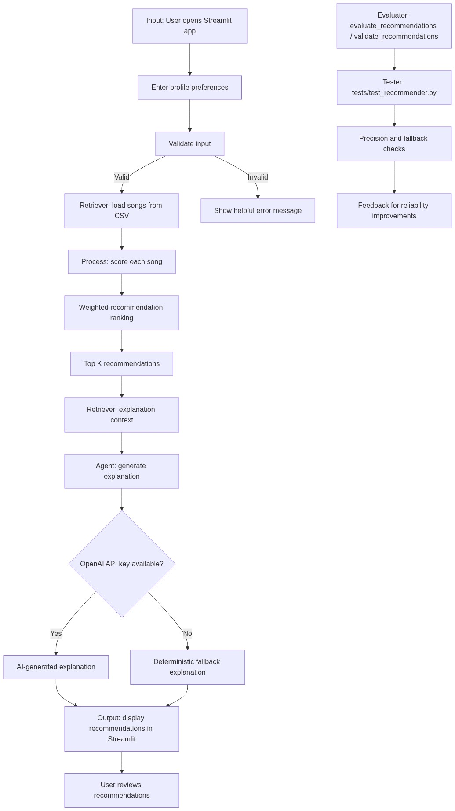

# 🎵 Music Recommender Simulation

## Project Title

Music Recommender Simulation

## Original Project Summary

This project started as a simple content-based music recommendation system. It compared a listener’s preferred genre, mood, and target energy level against songs in a local catalog, then ranked the best matches using a weighted scoring algorithm. The original version also focused on explaining why a song was recommended based on those song features.

## Project Overview

Today, the application runs through a Streamlit interface in `app.py`. A user selects preferences from catalog-driven dropdowns, adjusts the energy target, and receives ranked recommendations from the local song catalog in `data/songs.csv`.

The recommender uses a weighted scoring algorithm in `src/recommender.py` to compare the user profile with each song. The system then generates explanations for the recommendations. Those explanations use retrieved song context first, and if an OpenAI API key is available the app can generate an AI-assisted response. If no API key is available, the app falls back to a deterministic explanation so the experience still works.

## Architecture Overview

The system flow is straightforward:

1. The user opens the Streamlit app and enters preferences.
2. The app loads songs from the local CSV catalog.
3. Each song is scored with the weighted recommendation logic.
4. The results are ranked and the top `k` songs are selected.
5. The app retrieves supporting context for the selected songs.
6. An explanation is generated from that context.
7. If OpenAI is available, the explanation can be AI-assisted.
8. If OpenAI is not available, the app uses a deterministic fallback explanation.
9. The final recommendations and explanations are displayed in Streamlit.
10. The tests verify the ranking, retrieval, fallback behavior, and evaluation helpers.

The Mermaid diagram in `diagrams/architecture.md` shows that same input -> process -> output flow. It also separates the retriever, explanation agent, evaluator, and tester so the project structure is easy to follow.

## Architecture Diagram



The diagram above matches the current project flow in plain English:

- Input enters through Streamlit.
- The retriever loads the local song catalog.
- The recommender scores and ranks the songs.
- The explanation layer retrieves context and generates a response.
- OpenAI is optional, and the deterministic fallback keeps the app usable without an API key.
- The evaluator and tester live alongside the code to check reliability.

## Screenshots

Add screenshots here once you capture them from the Streamlit app.

- Main recommendations view: _screenshot placeholder_
- Expanded song explanation: _screenshot placeholder_
- Sidebar controls: _screenshot placeholder_

## Setup Instructions

### 1. Clone the repository

```bash
git clone <your-repository-url>
cd applied-ai-systems
```

### 2. Create a virtual environment

PowerShell:

```powershell
python -m venv .venv
.\.venv\Scripts\Activate.ps1
```

Mac or Linux:

```bash
python -m venv .venv
source .venv/bin/activate
```

### 3. Install requirements

```bash
pip install -r requirements.txt
```

### 4. Set `OPENAI_API_KEY`

The app checks the environment variable first and then safely tries Streamlit secrets, but setting the environment variable is the easiest option during local development.

PowerShell:

```powershell
$env:OPENAI_API_KEY="your_api_key_here"
```

You can also place the key in `.streamlit/secrets.toml` locally if you want Streamlit to read it automatically.

### 5. Run the Streamlit app

```bash
python -m streamlit run app.py
```

### 6. Run the tests

```bash
python -m pytest
```

## Sample Interactions

The examples below match what the project was like before I included the AI systems with the current dataset in `data/songs.csv` and the current recommendation behavior.

### Example 1: High-Energy Pop

User preferences:

- Favorite genre: `pop`
- Desired mood: `happy`
- Target energy: `0.90`
- Likes acoustic songs: `False`

Top recommendations:

```text
1. Sunrise City — Score: 4.42
2. Gym Hero — Score: 3.47
3. Rooftop Lights — Score: 2.36
```

Example explanation:

```text
Sunrise City is a strong fit because it matches the user's favorite genre, it matches the user's preferred mood, its energy level closely fits the target.
```

### Example 2: Chill Lofi

User preferences:

- Favorite genre: `lofi`
- Desired mood: `chill`
- Target energy: `0.35`
- Likes acoustic songs: `True`

Top recommendations:

```text
1. Library Rain — Score: 4.50
2. Midnight Coding — Score: 4.43
3. Focus Flow — Score: 3.45
```

Example explanation:

```text
Library Rain is a strong fit because it matches the user's favorite genre, it matches the user's preferred mood, its energy level closely fits the target.
```

### Example 3: Deep Intense Rock

User preferences:

- Favorite genre: `rock`
- Desired mood: `intense`
- Target energy: `0.95`
- Likes acoustic songs: `False`

Top recommendations:

```text
1. Storm Runner — Score: 4.46
2. Gym Hero — Score: 2.48
3. Backstreet Sparks — Score: 1.43
```

Example explanation:

```text
Storm Runner is a strong fit because it matches the user's favorite genre, it matches the user's preferred mood, its energy level closely fits the target.
```

## Design Decisions

I chose weighted scoring because it keeps the recommender easy to understand, deterministic, and transparent. Genre and mood are strong categorical signals, while energy and acoustic preference add additional nuance without making the system hard to explain.

I used retrieval before explanation generation because the explanation should be grounded in the actual song catalog. That makes the explanation more relevant and keeps the AI response tied to the songs the system actually recommended.

I added a deterministic fallback because I did not want the app to depend completely on an API key or external service. If OpenAI is unavailable, the app still gives a useful explanation.

The main trade-off is that this design is reliable and simple, but not as flexible as a full embedding-based retrieval system. The current implementation is also limited by the small local dataset, so recommendation quality depends on the catalog itself.

## Reliability and Evaluation

I ran the current test suite with `python -m pytest -v` and got:

- Collected: 6 tests
- Passed: 6
- Failed: 0

The existing tests in `tests/test_recommender.py` verify sorting behavior, explanation non-emptiness, retrieval prioritization for genre/mood, deterministic fallback behavior without an API key, and precision/validation helper outputs.

| Profile | Top Result Relevant? | Explanation Grounded? | Unsupported Details? | No Crash? | Notes |
| --- | --- | --- | --- | --- | --- |
| High-energy pop | Yes | Yes | No observed | Yes | Top result: Sunrise City (4.42). Explanation matches genre, mood, and energy signals. |
| Chill lofi | Yes | Yes | No observed | Yes | Top result: Library Rain (4.50). Explanation reflects exact lofi/chill and energy alignment. |
| Intense rock | Yes | Yes | No observed | Yes | Top result: Storm Runner (4.46). Explanation stays tied to retrieved song attributes. |
| Conflicting preferences | Partially | Yes | No observed | Yes | Top result: Sunrise City (3.88). Genre/mood matches still dominate despite low target energy. |

What worked: the ranking was stable and interpretable for coherent profiles, explanations remained readable, and deterministic fallback kept the app usable without OpenAI.

Weaknesses or surprises: fixed weights can strongly favor category matches, so conflicting preferences can still surface high genre/mood matches even when another signal is weaker.

Effects of fixed weights and small catalog: with a 20-song catalog and hard-coded bonuses, coverage and diversity are limited, and similar songs can repeat at the top.

Fallback reliability: current behavior is robust because recommendations and deterministic explanations continue even when an API key is not present.

Grounding of AI explanations: based on current deterministic runs and existing tests, explanation text stayed grounded in available song fields and did not introduce unsupported song titles.

Future reliability improvements:

- Add more edge-case tests for contradictory and sparse preference combinations.
- Add mocked API failure tests for explanation-path error handling.
- Add explicit grounding checks that compare explanation claims to retrieved song fields.
- Add duplicate-title and unsupported-title checks in recommendation/explanation outputs.
- Evaluate on a larger and more balanced catalog.
- Add diversity checks to track repeated genre/mood concentration in top-k results.
- Add precision@k evaluation on a richer labeled validation setup.

## Reproducible Execution Evidence

The following commands are the exact execution path used in this project for install, app runs, and tests:

```bash
pip install -r requirements.txt
python -m streamlit run app.py
python -m src.main
python -m pytest -v
```

Verified test result:

- `python -m pytest -v` -> 6 passed, 0 failed.

Verified example runs (from the current catalog and scoring logic) With AI applied systems:

### Example A: High-Energy Pop

Input:

- Favorite genre: `pop`
- Desired mood: `happy`
- Target energy: `0.90`
- Likes acoustic songs: `False`

Top recommendations:

```text
1. Sunrise City — Score: 4.42
2. Gym Hero — Score: 3.47
3. Rooftop Lights — Score: 2.36
```

Explanation:

```text
Sunrise City is a strong fit because it matches the user's favorite genre, it matches the user's preferred mood, its energy level closely fits the target.
```

Explanation source for this documented run: deterministic fallback (no OpenAI key required).

### Example B: Chill Lofi

Input:

- Favorite genre: `lofi`
- Desired mood: `chill`
- Target energy: `0.35`
- Likes acoustic songs: `True`

Top recommendations:

```text
1. Library Rain — Score: 4.50
2. Midnight Coding — Score: 4.43
3. Focus Flow — Score: 3.45
```

Explanation:

```text
Library Rain is a strong fit because it matches the user's favorite genre, it matches the user's preferred mood, its energy level closely fits the target.
```

Explanation source for this documented run: deterministic fallback (no OpenAI key required).

### Example C: API-Key-Enabled Streamlit Run (Ambient + Calm)

Input:

- Favorite genre: `ambient`
- Desired mood: `calm`
- Target energy: `0.80`
- Likes acoustic songs: `False`

Top recommendations:

```text
1. Spacewalk Thoughts — Score: 2.48
2. Quiet Harbor — Score: 1.51
3. Neon Skyline — Score: 1.49
```

Explanation:

```text
Spacewalk Thoughts is a strong fit because it matches the user's favorite genre.
```

Explanation source for this documented run: API-key-enabled path in Streamlit (key detected in app; explanation call was made with `api_key`, and the app returned the text above).

Run stability note: each of the documented runs completed without crashing and used songs loaded from `data/songs.csv`.

## Reflection

Working on this project helped me understand how RAG fits into an existing application without taking over the whole system. The recommender still needs to make the actual decision, but retrieval gives the explanation layer better context and makes the AI output feel more grounded.

I also learned that integrating AI into an existing app is less about adding a model everywhere and more about choosing where AI actually adds value. In this project, AI helps most with explanation generation, while the core recommendation logic stays deterministic.

One thing AI helped me with was shaping the explanation flow and identifying a clean way to retrieve supporting song context before generating text. One AI suggestion I had to modify was the idea of letting the model influence the recommendation ranking itself. I kept the ranking rule-based because that is easier to test and more reliable for this project.

If I improved this project next, I would expand the catalog, add richer retrieval with embeddings, and build a more complete evaluation set so I could measure recommendation quality more rigorously.

## Additional Notes

- The main app entry point is `app.py`.
- The song catalog lives in `data/songs.csv`.
- The architecture source is in `diagrams/architecture.md`.
- The architecture image is saved in `assets/architecture-flowchart.png`.
