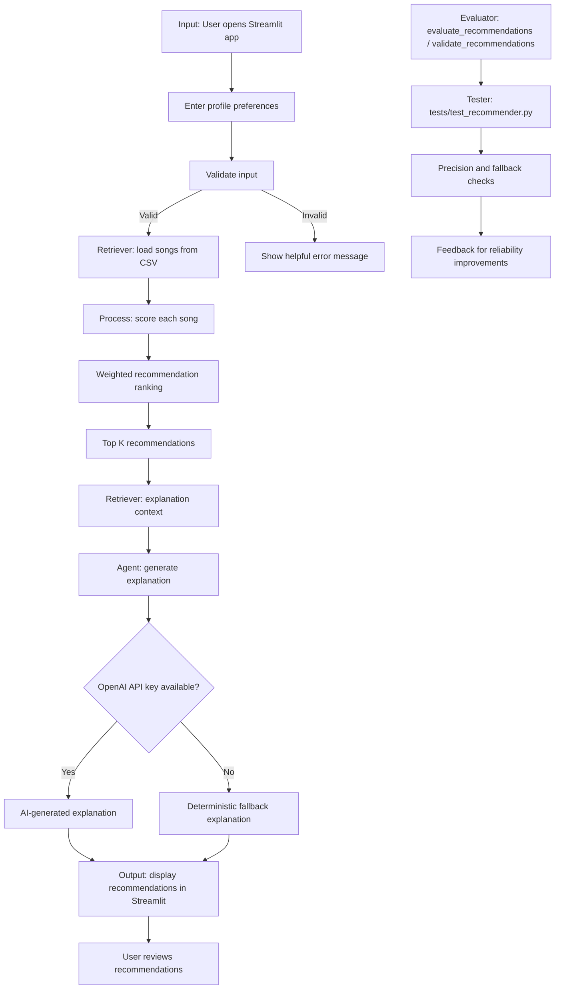

# Applied AI Music Recommendation System Architecture

## Workflow Summary

- Input starts in the Streamlit UI in `app.py`.
- The retriever loads the catalog from `data/songs.csv`.
- The recommender processes each song with weighted scoring and ranking.
- The explanation agent uses retrieved context and either calls OpenAI or falls back to deterministic text.
- The output is the ranked recommendations shown in Streamlit.
- The evaluator and tester live in `src/recommender.py` and `tests/test_recommender.py` to check precision and fallback behavior.